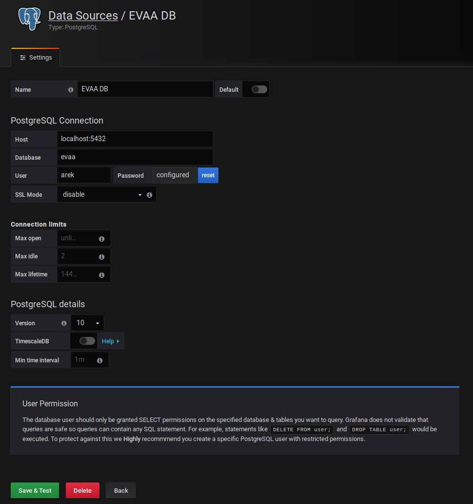

# Grafana example preparation manual

## Intro

* Based on Ubuntu 18.04 LTS
* Tested on x86 architecture

## Example screen captures


## Grafana installation

Install Grafana using official manual:

[Official Grafana installation manual](https://grafana.com/grafana/download)

**Example**:

```sh
wget https://dl.grafana.com/oss/release/grafana_6.3.3_arm64.deb
sudo dpkg -i grafana_6.3.3_arm64.deb
```

Then launch Grafana service:

```sh
sudo service grafana-server start
```

## PostgreSQL database preparation

Install PostgreSQL:

```sh
sudo apt install postgresql
```

Enter to database as `postgres` user:

```sh
sudo -u postgres psql
```

Create database:

```sql
CREATE DATABASE _DATABASE_NAME_;
```

**Example**:

```sql
CREATE DATABASE evaa;
```

Create user:

```sh
CREATE USER _USER_NAME_ WITH ENCRYPTED PASSWORD '_USER_PASSWORD_';
```

**Example**:

```sh
CREATE USER arek WITH ENCRYPTED PASSWORD 'salata';
```

Grant access to database (`_DATABASE_NAME_`) for created user (`_USER_NAME_`):

```sql
GRANT ALL PRIVILEGES ON DATABASE _DATABASE_NAME_ TO _USER_NAME_;
```

**Example**:

```sql
GRANT ALL PRIVILEGES ON DATABASE evaa TO arek;
```

Quit from the database:

```sql
\q
```

Connect to database as created user (`_USER_NAME_`):

```sh
psql _USER_NAME_ -h _DATABASE_SERVER_IP_ -d _DATABASE_NAME_
```

**Example**:

```sh
psql arek -h localhost -d evaa
```

Create table for measurements:

```sql
CREATE TABLE measurements (
    id SERIAL PRIMARY KEY,
    sensor_id VARCHAR(30) NOT NULL,
    "timestamp" TIMESTAMP NOT NULL,
    value DOUBLE PRECISION NOT NULL
);
```

Quit from the database:

```sql
\q
```

## Example measurement data

You can use `measurements-txt-to-db.py` Python script placed in
`evaa/documentation/grafana-example` directory.

You will need installed `libpq-dev` and `psycopg2`:

```sh
sudo apt install libpq-dev
pip3 install psycopg2 --user
```

Then enter to the directory with the `measurements-txt-to-db.py` script
and launch it:

> If you used another parameters than presented in the examples you should
> change them in `measurements-txt-to-db.py` script too.

```sh
./measurements-txt-to-db.py
```

## Enable HTML/JavaScript interpretation text panels in Grafana

In configuration file (default it's named `grafana.ini` and it's placed in
`/etc/grafana/` directory) change the following line:

```
;disable_sanitize_html = false
```

to:

```
disable_sanitize_html = true
```

Then restart `grafana-server` service:

```sh
sudo service grafana-server restart
```

## Connect to Grafana

You can connect to Grafana dashboard using every web browser. The default
port is `3000`.

The Grafana dashboard address:

```
_GRAFANA_SERVER_IP_:_GRAFANA_SERVER_PORT_
```

**Example**:

```
localhost:3000
```

The default `login/password` are `admin/admin`.

## Connect Grafana with PostgreSQL database

1. Login to Grafana.

2. Select `Configuration > Data Sources` available on the bar on the left side.

3. Click on `Add data source` button.

4. Select `PostgreSQL`.

5. Fill configuration according to the parameters given when creating
   the database.

**Example configuration**:



6. Click on `Save & Test` button.

7. Done :)

## Import example dashboard from JSON file

1. Login to Grafana.

2. Select `Create > Import` available on the bar on the left side.

3. Click on  `Upload .json file` button.

4. Select `grafana-dashboard-model.json` file placed in 
   `evaa/documentation/grafana-example` directory.

5. Click on `Import` button and it's all.
