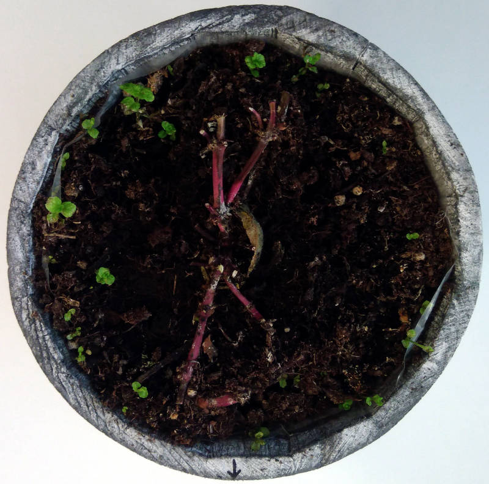
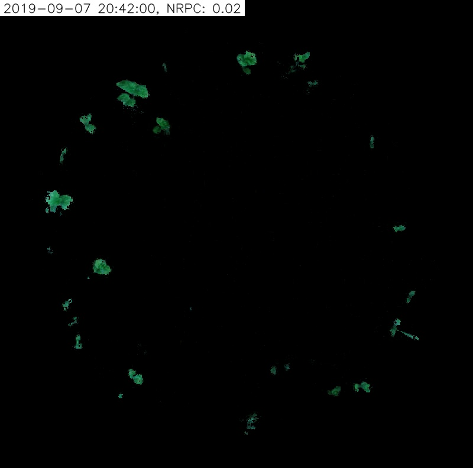
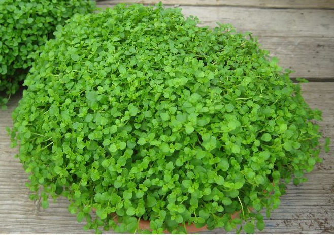
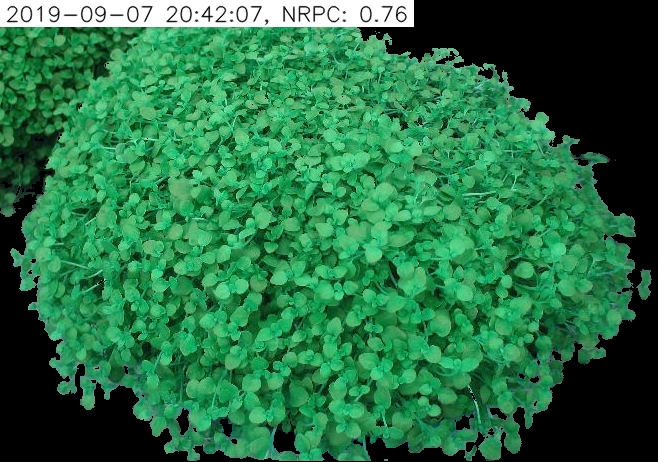

# Camera demo

The goal of this project is to provide tools for measuring a green surface of a plant. 
There three interfaces available:

- ``PySide2`` GUI
- ``OpenCV`` GUI
- command line

## PySide2 GUI

- Run the application: ``python run_qt.py``
- Select color: ``Ctrl + "Left Mouse Click"``

## OpenCV GUI

- Run the application: ``python run_opencv.py``
- Quit the application: ``q``
- Select color: ``Left Mouse Click``

## Command line interface

### Example 1

Command:

```
python run_console.py \
--r=0 --g=255 --b=255 \
--negdh=60 --posdh=0 \
--mins=140 --maxs=255 \
--minv=0 --maxv=200 \
--input_path=samples/sample_1_in.jpg \
--output_path=samples/sample_1_out.jpg
```

Input image:


Output image:


### Example 2

```
python run_console.py \
--r=0 --g=255 --b=255 \
--negdh=60 --posdh=60 \
--mins=90 --maxs=255 \
--minv=0 --maxv=255 \
--input_path=samples/sample_2_in.jpg \
--output_path=samples/sample_2_out.jpg
```

Input image:


Output image:
